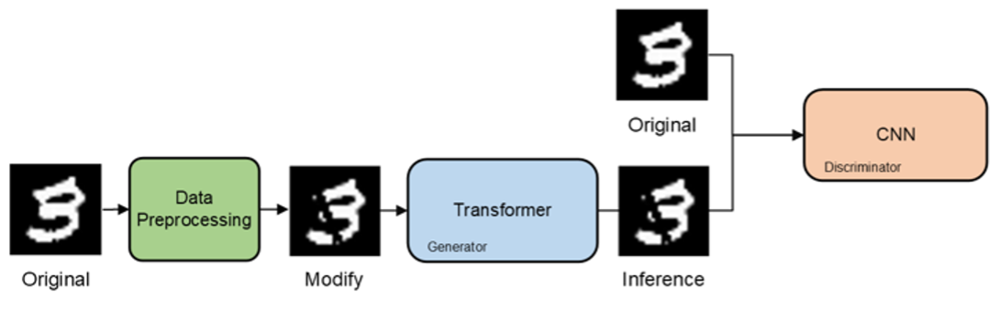
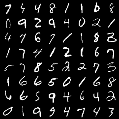
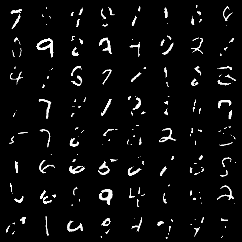
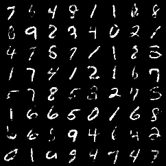

<br/>
<p align="center">
  <h3 align="center">TransGAN on image compensation</h3>

  <p align="center">
    A hybrid model of transformer implement on image
    <br/>
    <br/>
    <a href="https://dearestbee.tplinkdns.com/demo">View Demo</a>
  </p>
</p>

     

## Table Of Contents

* [About the Project](#about-the-project)
* [Getting Started](#getting-started)
  * [Prerequisites](#prerequisites)
  * [Installation](#installation)
* [Usage](#usage)
* [Contributing](#contributing)
* [License](#license)
* [Authors](#authors)
* [Acknowledgements](#acknowledgements)

## About The Project



The research project aims to develop a new type of digital image compensation model. This model is based on the combination of Transformer and Generative Adversarial Network (GAN). 

It's primary application is in the field of Optical Character Recognition (OCR), aimed at solving the problem of decreased character recognition accuracy due to external factors like dirt and lighting. 

The model utilizes the attention mechanism of the Transformer to focus on detailed features, while also employing the adversarial generative characteristics of GANs to enhance the quality of the generated compensation images. 

This method, which combines the advantages of both, aims to reduce the dependence on supervised training and automatically generate more refined compensation models.

|Original|Modify|Inference|
|-----|--------|--------|
||||

||Parameters|SSIM|PSNR|MSE|
|-----|--------|--------|--------|--------|
|TransGAN|3.08M|0.85|16.14|24.75|
|CNN|0.08M|0.84|15.86|26.60|

## Getting Started
### Prerequisites

* pip

```sh
pip install -r requirements.txt
```

### Installation

Clone the repo

```sh
git clone https://github.com/NickLin910221/TransGAN.git
```

## Usage

### Train
```sh
python train.py
```

### Inference
```sh
python inference.py
```

## License

Distributed under the MIT License. See [LICENSE](https://github.com/NickLin910221/TransGAN/blob/main/LICENSE.md) for more information.

## Authors

* **You-rui, Lin** - *National University Of Tainan* - [You-rui, Lin](https://github.com/NickLin910221/) - *Whole Project*

## Acknowledgements

* [陳宗禧](https://home.nutn.edu.tw/chents/index-c.html)
